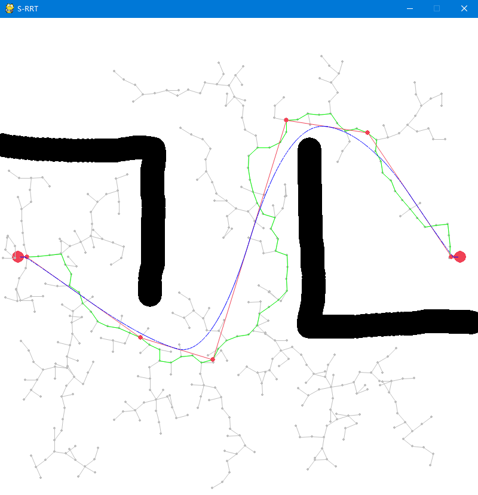

# Smoothly RRT
基于RRT的连续曲率轨迹生成算法。。

## 使用
在configs.py中设定好初始位置和终止位置等参数后，运行main.py。

单击鼠标左键添加障碍物（注意不可离起始位置和终止位置过近以免影响随机树生成），再次单击则停止添加；单击鼠标中键清空已有障碍物；单击鼠标右键开始生成轨迹。

最终结果如下图所示，其中绿线是根据RRT生成的路径，红线是优化后得到的路径，其上红色的点为样条曲线的控制点，蓝线则为根据这些控制点计算得到的B样条曲线，也就是生成的轨迹。

## Packages required
pygame, numpy, matplotlib.

## References
Wei K, Ren B. A method on dynamic path planning for robotic manipulator autonomous obstacle avoidance based on an improved RRT algorithm[J]. Sensors, 2018, 18(2): 571.
